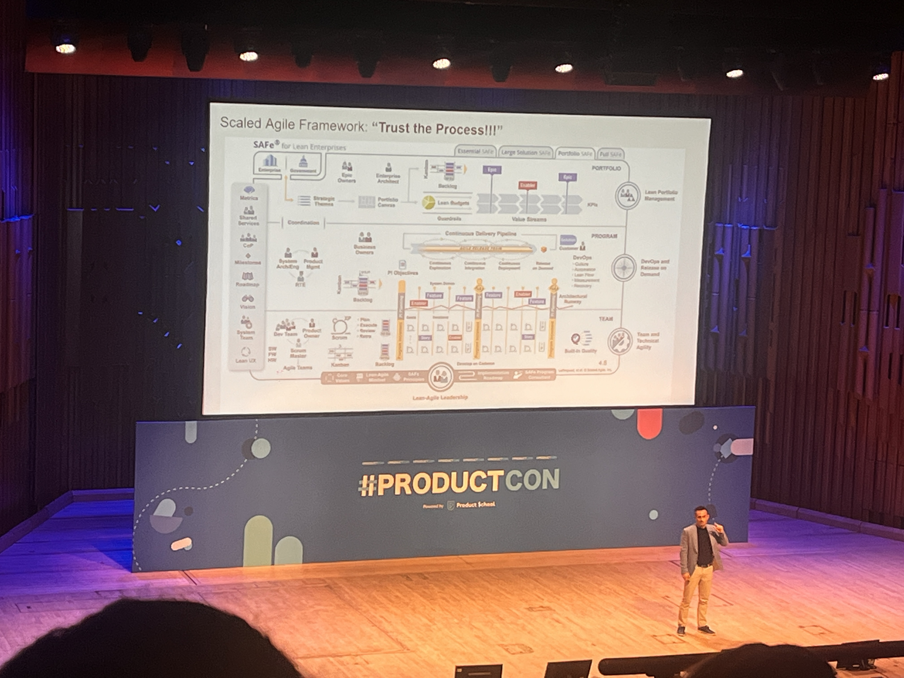

Here are some notes from attending ProductCon 2025,  "the bleeding edge of product management" as described by the panelists and experts. There were some interesting ideas, and here are some raw bullet points, in no particular order:

- We're in the AI goldrush era, and the best way to look at this might be too go broad, instead of going narrow. This goes against the grain, and is counterintuitive with all the product led principles, to think of the technology first (and not the user), and to think of all the various ways in which you could put AI into everything. Of course, it's dangerous in excess, so a good idea is to keep a budget for this exploration. Debbie and team have found various ways to incorporate GenAI into customer experience, staff processes, marketing+sales, and to even find better stories for their product.
- Debbie and their team from Financial Times have not just experimented within the confines of the off-the-shelf language models such as ChatGPT etc, but have also experimented with other language model providers, delivery services and even some eval services. Everything is ripe for experimentation. In this context of FT as a product, they've found various practical applications of AI such as — uncovering various hidden gems helping find the 'needle in the haystack'. AI generated summaries for blog excerpts, askFT that's trained on all the stories they've produced, and made available for their paying customers, remixing content in various formats or even the simple (and easy) generation of alt-text by AI
- Companies are slowly shifting from looking at products from the vantage point of being a cost saver, to more of a revenue centre, and now towards creating levers for a true competitive advantage.
- Usually the textbook strategy is to turn your strategic investments to first tackle those quick wins (which are high impact, and low effort). But usually these end up turning into high effort endeavours, and it's important to also look at quick kills (apart from quick wins). And if you're scared about killing an idea, kill it for a small segment of the customers, and if the customers don't feel the hit, or the pain point from not being able to use the feature, it's highly likely that they might not need it anyways.
- Tying product management to more revenue-driven outcomes. There could be some experimentation in terms of introducing variable compensation for product managers (15-25%) — This could be big enough to drive them towards the right behavior change, but not too big that it course corrects the product managers for prematurely optimising for short term outcomes.
- Product managers should embed their work more closely with the sales functions. And this is coming as a reflection from the culture often seeing in silicon valley companies where product people often join sales calls with account executives. These are very different from the user research calls, and can give product folks great exposure through the medium of client calls and tailor demos.
- We need to change the framing of ‘managers’ to ‘player coaches’ — product managers are not sitting in their ivory towers and orchestrating strategy, but are leading with expertise  
- Have you seen yourself reusing the same existing slides for various program/product related rituals in a week/month/quarter? There are high chances that there might be useless redundancy creeping up and you might not need most of these rituals. A good moment for you to reflect upon. You might actually need all those ceremonies, committees, gates and handovers.
- Canonical docs popularised by Naomi Klein, CPO of Facebook is a great example of instiling extreme clarity among team members on the status of a particular initiative. Especially when a product leader jumps in to assess the priority of an initiaitive, they would like to know the problem, proposed solution, and the decision log at a high level. This canonical doc corrals the team and the decisions together into a single unit for alignment.
- If there are competing KPIs what would you do? You might probably want to understand what's the top most priority from the business, and see if that solves the conflict. But if both the KPIs are deemed to be equally important, then you might think of the following eigen-questions — which KPI drives the impact faster? (or) which KPI would help you get to learning faster?

Naturally, I was curious to know how much AI agents have affected product management as a discipline. And there was a talk around how the Pendo team uses AI in various contexts for productivity gains. It can be leveraged in user research, data analytics, roadmapping, debugging, session replays, experimentation etc. Some AI tools that could supercharge PM work:

- Superwhisper, BetterDictation are [great transcription tools]([[Idea in the shower, testing before breakfast]]), you could shoot up your words per minute from 50 to ~220 wpm using this. Keyboard is a bottleneck for us knowledge workers. This is especially in this world and place where [[Quality ideas trump execution | quality ideas trump execution]].
- Sunsama is a fantastic calendar on steroids, helping you schedule your tasks in between your calendar meetings. So you can save your focussed time for getting things done.
- Claude's mobile app is great for ranting your raw, unstructured thoughts into, and it helps to provide clarity to your ramblings, and helping compose them into various formats such as memos, essays, notes, outlines etc.
- Developer console in Claude can also help you do some metaprompting (i.e prompting to generate a better prompt, to then feed this prompt to AI for better outputs). With this detailed prompt, you could use this as a feed to the Project Instructions section of your [Claude projects.]([[Idea in the shower, testing before breakfast]])
- Chorus.sh helps you mix and match responses from an army of workers (multiple large language models) to help you out find the best response (or even synthesize them together)
- For agentic workflows, Gumloop.ai is a great offering, and it seems to be an AI-first competitor to n8n, Make, Zapier, IFTTT etc. Allows you to quickly create various sequences stitching and stacking various SaaS tools saving weeks of human effort in a short span of time.