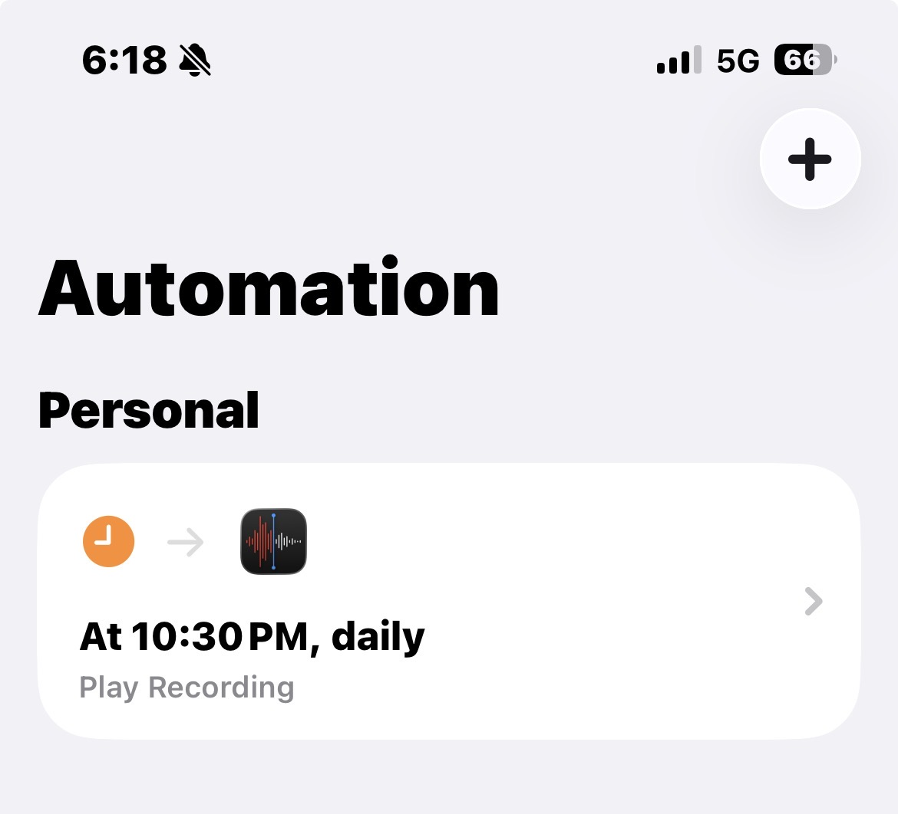
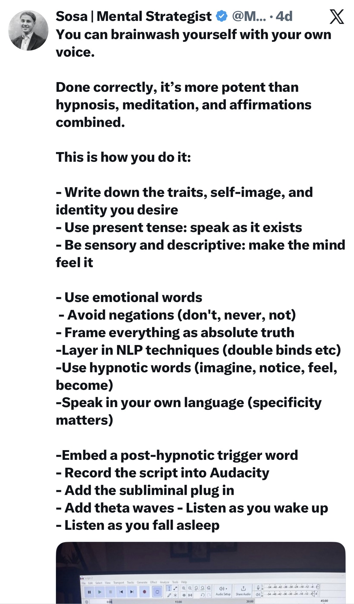

I’ve set up an Apple shortcut to wake me up with a personal voice message. This is particularly scripted in a prophetic future tense, where I’m talking as if whatever I wanted to achieve has already 

I’m not sure how the results would be, but I’m planning to experiment doing this for the rest of the year and report back if this has been successful or not.. 

I’m running this experiment as it’s an offshoot of two ideas: that your voice is very powerful in making a behavioral transformation.  And the second, the idea that talking in future past tense, in a way that the idea you wanted to happen has already happened, can in fact make things happen.. 

You follow this script on repeat mode everyday, and the idea here is to make this script tap into your subconscious.. 

For now, I only have a “lean MVP” where it is just my plain voice, I would like to experiment with theta waves in the background in the future..

I am still skeptical about the science behind it, and apparently there are certain frequencies shift what mode your brain operates in. Theta waves (4-8 Hz) are associated with deep relaxation, meditation, and suggestibility. This is the state hypnotherapists try to induce. It's the state right before sleep where your subconscious is most open. So the attempt here is to do this right before you go to bed.. 

Many types of music... especially ambient, binaural beats, or certain electronic genres contain frequencies that push your brain toward theta. And by using this as background score for this memo spoken in your voice, it could potentially increase the effect.. 

Wouldn't it fascinate you to realize that every song you've ever listened to on repeat has installed beliefs into your mind without your permission?

I have also embedded a post-hypnotic trigger word as “steady” to indicate the state I would like to be oriented more towards.. 

