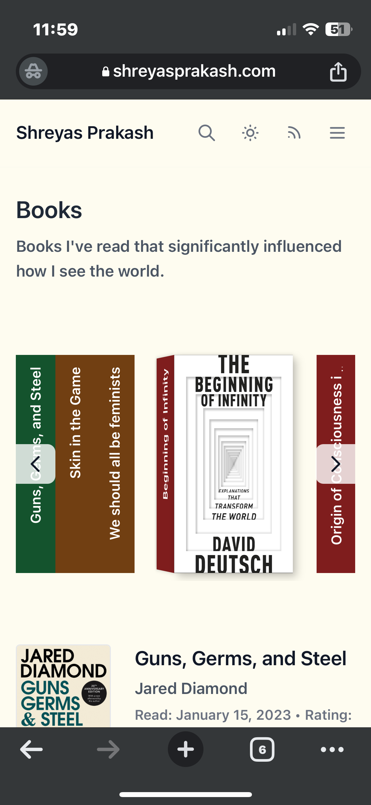
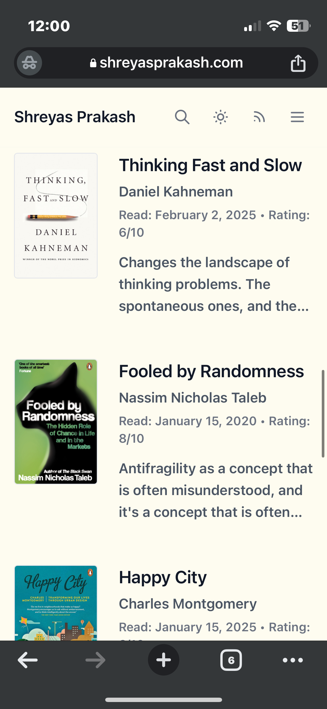
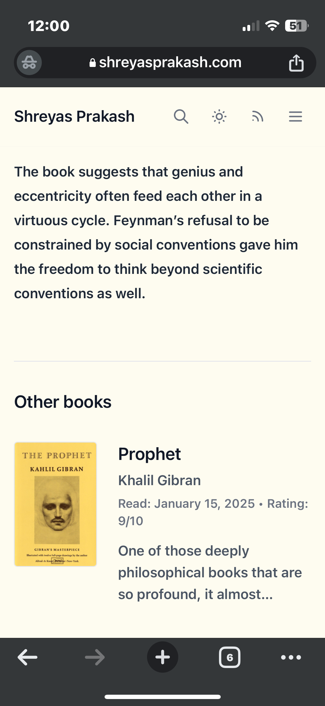

A memory I’ve been longing to create virtually — is this experience of inviting your guests home, and showing them your bookshelf. The guests then come across a book of common interest and we end up sprawling other adjacent topics while I try my best to connect them with the books on my bookshelf. 

After moving across a couple of continents, and work locations, the longing for recreating this experience has remained unchanged.  

The first encounter with a [virtual bookshelf has been from Derek Sivers’ site](https://sive.rs/book).
Sivers has a profilic collection of 400+ book notes, meta-notes that span various themes, and I usually prefer more such recommendations from virtual bookshelves of other’s personal sites, rather than the slug you find on Goodreads or Amazon reviews. 

These were not the usual goodreads summaries you find, but more of meta-notes and side threads (which go atleast some layers deeper than the surface level conversations)

Inspired by these, I wanted to have these set of design choices for my virtual bookshelf:

1. You need to have a visual overview of books which you can interact with
2. Possibility to add book ratings, one-line descriptions
3. Adding some scope for serendipity by having an option to discover other book notes, based on previous reads

After spending some careful time in identifying a GitHub repository that matched most of my very particular needs ([Adammaj’s bookshelf.tsx component](https://github.com/adam-maj)), I then fired up my Cursor IDE window to do some vibe-coding and finally got the integration on my site right. 

I wanted the shadows that the books leave behind to be just right. I wanted the way you flip the book towards yourself to be the right micro-interaction. All those little details.

