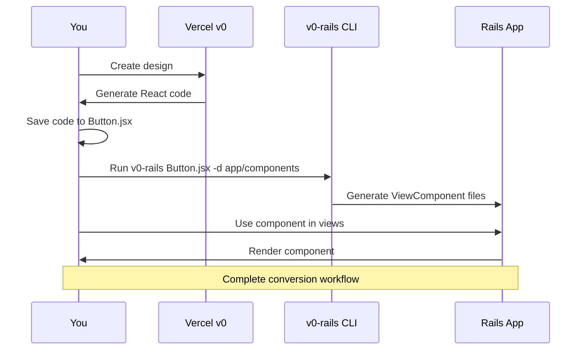
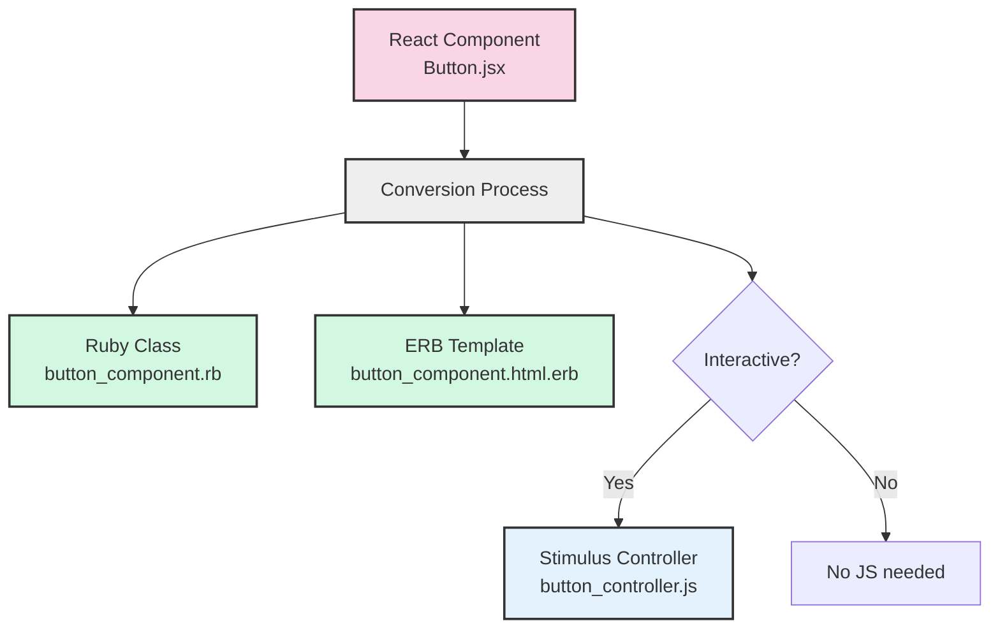

One of the delights of building solo projects with Ruby on Rails is the framework's thoughtfully chosen defaults. These carefully selected conventions allow developers to focus more on modeling business logic and core value propositions rather than evaluating endless package options. While exploring development across both Rails and JavaScript ecosystems, it's become apparent how much time in JavaScript development can be consumed by dependency selection and configuration—a process that often feels at odds with the creative joy that drew many of us to programming in the first place.

For prototyping interfaces quickly, v0.dev has emerged as a remarkable tool. It generates polished UI mockups that closely align with mental visions—often requiring only minor adjustments to achieve the desired result. However, a persistent challenge arises: these beautifully crafted components are produced as NextJS/React UI code, creating a barrier for Rails developers wanting to incorporate them into their projects.

This disconnect between modern design tooling and Rails development inspired a modest attempt to bridge the gap: a conversion utility that transforms React/JSX + Tailwind code components from v0.dev into Rails ViewComponent classes with ERB templates.

This [v0-rails npm package](https://www.npmjs.com/package/v0-rails) aims to provide a simple pathway between these different worlds. The utility transforms v0.dev React components into Rails ViewComponents while detecting and preserving dynamic content areas through intelligent slot handling. It maps React icon components to appropriate Rails equivalents, generates sensible routes for navigation components, and maintains the integrity of Tailwind CSS classes and styling. The underlying goal isn't to create something revolutionary but simply to reduce the friction between these powerful tools, allowing Rails developers to benefit from v0.dev's design capabilities without the tedium of manually rewriting each component.

Example usage remains straightforward:

```bash
# Install globally
npm install -g v0-rails

# Convert a component
v0-rails convert my-v0-component.jsx --output app/components
```

The conversion process addresses several common translation points that would otherwise require manual intervention. It converts JSX syntax to ERB, transforms React props into ViewComponent parameters, preserves component relationships, and maintains all the carefully crafted Tailwind styling from the original design.
  
## Getting Started (Simple Example)

The workflow follows a natural progression:




Step 1: Generate a design with v0.dev

Visit [v0.dev](https://v0.dev/) to create your interface element (such as a button, card, or form). The service will generate React code similar to:

```js
// Button.jsx
export function Button({ children, variant = "primary", size = "medium" }) {
  return (
    <button className="rounded-md font-normal bg-blue-500 text-white px-4 py-2">
      {children}
    </button>
  )
}
```

### Step 2: Save the generated code

Store the React component in a file like `Button.jsx` on your computer.

### Step 3: Run the conversion

Execute the v0-rails converter to transform the React component:

```shell
v0-rails Button.jsx -d app/components
```

### Step 4: Integrate with your Rails application

The resulting ViewComponent can be used naturally in any Rails view:

```html
<%# In any Rails view %>
<%= render(ButtonComponent.new) do %>
  Click me!
<% end %>
```

The component is now seamlessly integrated within your Rails application.

## Understanding What Happens

The conversion process generates several interconnected files that work together to recreate the original component's functionality. First, it creates a Ruby class (`app/components/button_component.rb`) that handles the component's logic and parameters. Next, it builds an ERB template (`app/components/button_component.html.erb`) containing the converted markup and styling. For interactive elements, it might also generate a Stimulus controller to manage client-side behavior. Throughout this process, the original design intent is preserved while adapting to Rails conventions.



A key benefit is that no React knowledge is required to use these converted components—they function like any other Rails components within your application. This allows Rails developers to take advantage of v0.dev's design capabilities without needing to learn React or maintain two parallel component systems.