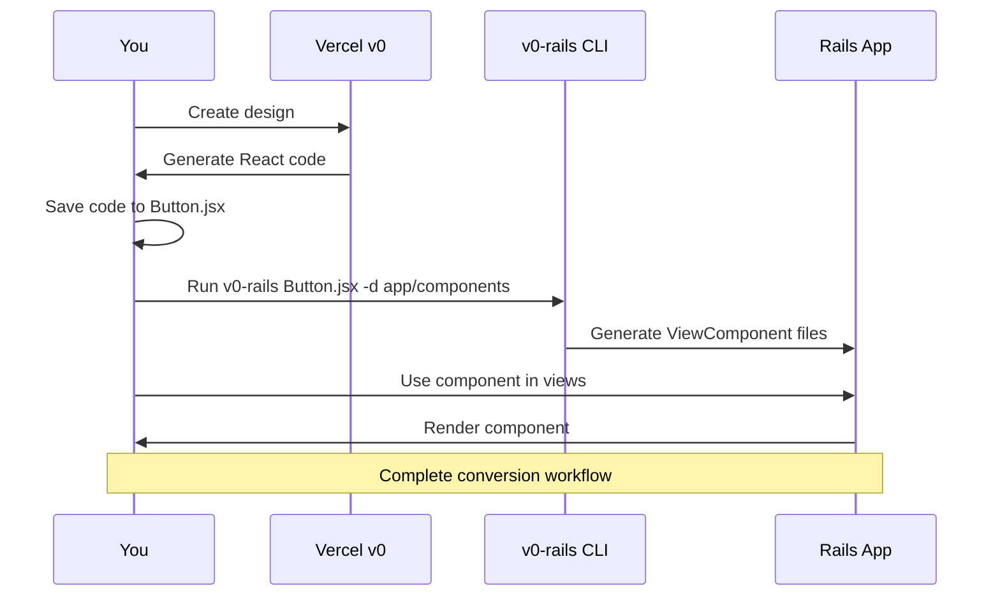
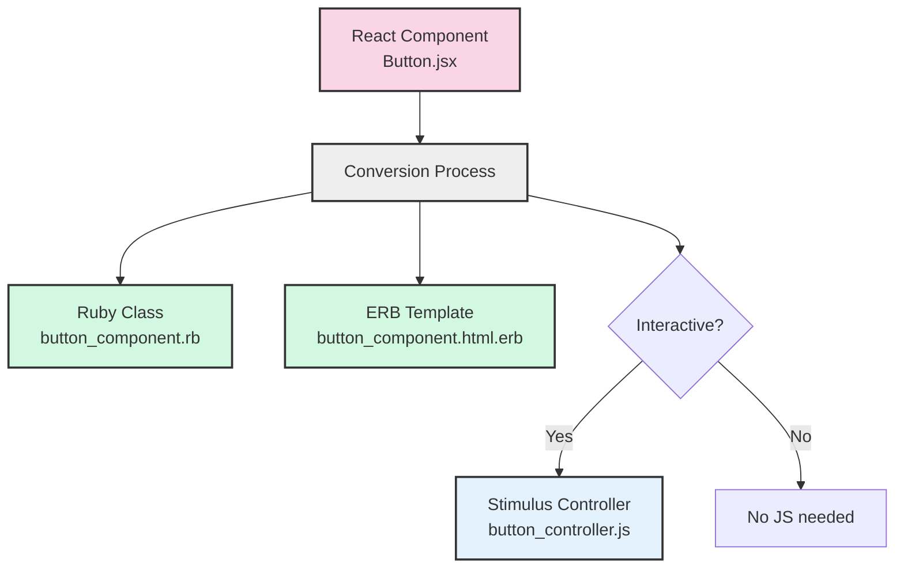

As a Rails developer who builds passion projects solo with this framework, i find myself blessed with an array of well-thought defaults for each specific utility. These vetted defaults make it really convenient to think more of the actual modelling of the business, and the core value proposition instead of having to think about the right package that's well maintained and that which is compatible with what we're doing. From my limited knowledge developing projects in Javascript Land, as well as in the Rails land, I find that most time spent in Javascript Land is in choosing the right library or a package or a dependency. That's not what i imagined software building to be like. It is supposed to be fun and imaginative and creative and so many other things.

A tool which I have been using to quickly prototype front end is this service called v0.dev. It helps in quickly building mockups which have great flair and pizzazz. The designs are atleast 90% in line with what i had in mind, and I just have to modify some of these components generated with surgical precision to get where i want. Now, the unfortunate reality here is that this tool is very handy to generate NextJS/React UI, and it isn't compatible with Ruby on Rails projects.

To convert these React/JSX + Tailwind uI code components from v0.dev into Rails in the format of ViewComponent classes with ERB templates, I built this npm package to make this conversion easier.

You can find the [v0-rails npm package](https://www.npmjs.com/package/v0-rails) with complete documentation and usage examples. The tool provides a bridge between the v0.dev design platform and Rails applications:

- Automatic conversion of v0.dev React components to Rails ViewComponents
- Intelligent slot detection for dynamic content areas
- Icon handling with automatic mapping to appropriate Rails icon helpers
- Route generation for navigation components
- Preservation of Tailwind CSS classes and styling

This utility significantly speeds up the process of implementing v0.dev designs in Rails applications by automating the tedious conversion process.

Example usage:

```bash
# Install globally
npm install -g v0-rails

# Convert a component
v0-rails convert my-v0-component.jsx --output app/components
```

The tool automatically handles:
- JSX syntax conversion to ERB
- React props to ViewComponent parameters
- Component nesting and relationships
- Tailwind class preservation
- 
## Getting Started (Simple Example)

Let's walk through a basic example of converting a v0 component:




Step 1: Get a v0 design

First, visit [v0.dev](https://v0.dev/) and create a design (like a button, card, or form). v0 will generate React code that looks something like this:

```js
// Button.jsx
export function Button({ children, variant = "primary", size = "medium" }) {
  return (
    <button className="rounded-md font-normal bg-blue-500 text-white px-4 py-2">
      {children}
    </button>
  )
}
```

### Step 2: Save the v0 code

Save this code in a file (like `Button.jsx`) on your computer.

### Step 3: Convert to Rails

Now run the v0-rails converter:

```shell
v0-rails Button.jsx -d app/components
```

### Step 4: Use in your Rails app

The converter creates a ViewComponent you can use in your Rails views:

```html
<%# In any Rails view %>
<%= render(ButtonComponent.new) do %>
  Click me!
<% end %>
```

That's it! Your v0 design is now a Rails component.

## Understanding the Conversion

When v0-rails converts a component, it creates:

1. A Ruby class (`app/components/button_component.rb`)
2. An ERB template (`app/components/button_component.html.erb`)
3. Optional Stimulus controller for JavaScript interactions



You don't need to understand React to use these components - they work like regular Rails components.